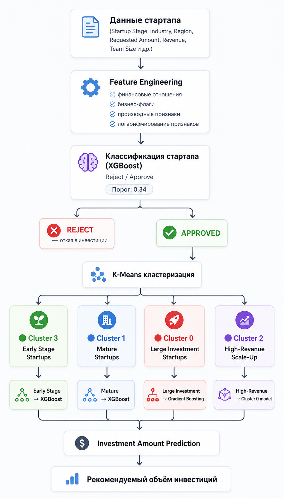

# 📊 Риск и распределение инвестиций в стартапы  
### ML система для венчурного анализа

---



## 🧠 Описание проекта

Данный проект представляет собой машинное решение для поддержки венчурных инвестиционных решений. Система позволяет:

- определить, стоит ли инвестировать в стартап (классификация);
- оценить вероятность отказа;
- спрогнозировать оптимальный объём инвестиций (регрессия);
- учитывать сегментацию стартапов по уровню зрелости и масштабу.

Цель проекта — снижение времени и неопределённости при принятии инвестиционных решений за счёт автоматизации аналитического пайплайна.

---

## ⚙️ Бизнес-задача

Венчурные инвестиции характеризуются высокой неопределённостью и сильной дисперсией исходов. В рамках проекта решаются две ключевые задачи:

1. **Отбор стартапов (Reject / Approve)**
   - классификация инвестиционной привлекательности
   - оценка вероятности отказа

2. **Прогноз объёма инвестиций**
   - регрессия целевого значения `investment_amount`
   - адаптация модели под сегмент рынка

---

## 🧰 Стек технологий

- Python  
- pandas, numpy  
- scikit-learn  
- XGBoost, LightGBM  
- MLflow  
- matplotlib, seaborn  
- joblib  
- SQL  

---

## 📦 Данные и признаки

Использовались данные стартапов, включающие:

- финансовые показатели (revenue, valuation, requested_amount)
- характеристики команды (team_size, experience)
- стадия развития (startup_stage)
- география и индустрия
- дополнительные инженерные признаки (ratios, logs, interactions)

---

## 🔧 Feature Engineering

Были добавлены признаки:

- отношения финансовых метрик (valuation ratios, revenue ratios)
- показатели команды (maturity, experience density)
- бинарные бизнес-флаги (early_stage, is_us_market)
- логарифмированные признаки для стабилизации распределений

---

## 🧩 Кластеризация стартапов

Для повышения качества прогнозирования была применена K-Means кластеризация (без использования целевой переменной).

### Сегменты:

- **Cluster 3 — Early Stage Startups**
- **Cluster 1 — Mature Startups**
- **Cluster 0 — Large Investment Startups**
- **Cluster 2 — High-Revenue Scale-Up Startups**


Кластеризация позволяет учитывать нелинейную структуру рынка и строить специализированные регрессионные модели.

---

## 🧠 Модельный пайплайн

```text
Startup Features
        ↓
Reject / Approve Classifier (XGBoost, threshold=0.34)
        ↓
Cluster Assignment (KMeans)
        ↓
Cluster-specific Regression Model
        ↓
Investment Amount Prediction
```

---

# 📈 Результаты

---

# 🟢 1. Классификация (Reject / Approve)
- ROC-AUC (CV): 0.74
- ROC-AUC (Test): 0.76
- F1-score: 0.59
- Threshold: 0.34

# 📊 Регрессия по кластерам

## Cluster 3 — Early Stage Startups (XGBoost)
- MAPE: 23.85%
- R²: 0.807
- MAE: $248K

## Cluster 1 — Mature Startups (XGBoost)
- MAPE: 21.94%
- R²: 0.744
- MAE: $504K

## Cluster 0 — Large Investment Startups (Gradient Boosting)
- MAPE: 18.88%
- R²: 0.469
- MAE: $1.13M

## Cluster 2 — High-Revenue Scale-Up
- Недостаточный объём данных для стабильного обучения
использована модель ближайшего крупного кластера.

---

# 💡 Ключевые инсайты
- cегментация стартапов значительно улучшает качество регрессии;
- разные стадии развития требуют разных моделей;
- распределение инвестиций сильно асимметрично и нелинейно;
- логарифмирование и feature engineering критичны для стабильного обучения;
- модель показывает лучшую точность на ранних и средних стадиях рынка.

## Интерпретация влияния признаков на решение о финансировании стартапа (XGBoost)

Анализ важности признаков модели XGBoost показал следующие ключевые закономерности в процессе принятия решений о финансировании стартапов.

---

### 1. Доминирующие количественные показатели стартапа

Наибольшее влияние на решение модели оказывают финансовые и командные метрики:

- `annual_revenue` (годовая выручка) — **наиболее сильный фактор модели**: высокий доход существенно снижает вероятность отказа в финансировании.
- `founders_experience_years` (опыт основателей) — опытная команда значительно повышает шансы на одобрение.
- `team_size` (размер команды) — более крупные команды воспринимаются как менее устойчивые и менее рискованные.
- `requested_amount` (запрашиваемый объём инвестиций) — согласно SHAP, увеличение суммы инвестиций повышает вероятность одобрения.
- `pre_money_valuation` (оценка стартапа до инвестиций) — заниженная оценка также может увеличивать инвестиционный риск.

---

### 2. Стадия развития стартапа

Стадия стартапа является важным структурным фактором риска:

- Ранние стадии (**Pre-Seed**) связаны с более высокой вероятностью отказа.
- Более зрелые стадии (**Seed**, **Series A**, **Series B**) снижают риск и повышают вероятность одобрения финансирования.

Это отражает естественную логику венчурного инвестирования, где зрелость бизнеса снижает неопределённость.

---

### 3. Отраслевые и географические факторы

Категориальные признаки оказывают умеренное, но стабильное влияние:

- Наибольший вклад среди отраслей наблюдается у **FinTech**, что указывает на повышенное внимание модели к данной категории.
- Другие отрасли (HealthTech, E-commerce, EdTech, ClimateTech) имеют сопоставимое, но менее выраженное влияние.
- Географические признаки показывают умеренное влияние:
  - стартапы из США (`region_US`) имеют несколько более благоприятный профиль,
  - Европа и LATAM демонстрируют относительно более высокий риск отказа.

---

### 4. Общая интерпретация модели

Модель демонстрирует, что принятие решений о финансировании в основном определяется следующими группами факторов:

- **Финансовая зрелость стартапа** (выручка, оценка, объём инвестиций)
- **Качество и опыт команды** (размер и опыт основателей)
- **Стадия развития проекта**
- **Дополнительные контекстные факторы** (индустрия и регион)

---

### Вывод

Модель XGBoost воспроизводит реалистичную логику венчурного инвестирования:

- ключевым фактором является **финансовая устойчивость стартапа**
- важную роль играет **компетентность команды**
- а также **стадия развития и контекст рынка**

Таким образом, модель можно интерпретировать как инструмент первичного риск-скоринга, который помогает инвестору быстро отсекать высокорисковые проекты на основе структурированных бизнес-признаков.

---

## Ограничения
- Малый размер некоторых кластеров (особенно scale-up сегмента);
- Высокая чувствительность к выбросам в финансовых данных;
- Ограниченная обобщающая способность на новых рынках;
- Отсутствие внешних макроэкономических факторов.

